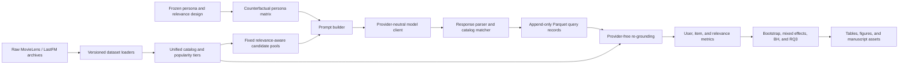

# Complete project documentation

**Project:** Item-side exposure fairness in personality-conditioned LLM recommenders  
**Study title:** *Who Gets Seen? Auditing Item-Side Exposure Disparities Induced by
Personality-Conditioned Prompting in LLM-Based Recommender Systems*  
**Document status:** Living technical and scientific overview  
**Last updated:** 2026-08-02  
**Current execution status:** All six scientific pilot model/domain pairs are complete and
audited. No full-scale collection has started.

This file is the central documentation index for the project. It consolidates the design,
architecture, implementation, operational workflow, audit history, pilot diagnostics,
limitations, and publication gates. Detailed formula and provenance contracts remain in the
linked versioned files; this document does not replace those source records.

## 1. Project purpose

The project audits whether personality language in an LLM recommendation prompt changes not
only an individual user's recommendation list, but also aggregate exposure across the item
catalog. The catalog, candidate opportunity, stated taste, relevance labels, and decoding
parameters are controlled. The counterfactual treatment is the implied Big-Five trait pole and
the wording variant.

The study is inference-only. It does not train, fine-tune, or alter any language model.

The core scientific distinction is:

- **User-side fairness:** how much one persona's personality-conditioned list changes relative
  to the same persona's neutral list.
- **Item-side fairness:** how concentrated or redistributed catalog exposure becomes after
  recommendations are aggregated across personas under a condition.
- **Utility control:** whether a fairness difference is accompanied by a relevance collapse.

## 2. Research questions

- **RQ1:** Does aggregate item exposure shift under personality-conditioned prompting relative
  to the neutral baseline?
- **RQ2:** Do Big-Five trait poles produce different popularity-tier, genre, or provider
  exposure patterns?
- **RQ3:** Are user-side and item-side fairness rankings concordant, independent, or inverse?
- **RQ4:** Are the effects consistent across model snapshots and domains?
- **RQ5 (stretch):** Can an inference-time fairness instruction reduce item-side disparity
  without materially reducing relevance?

The research proposal is the scientific rationale and literature starting point:
[research proposal](research_proposal_recllm_item_side_fairness%20%281%29.md).

## 3. Current status

### Engineering

- The complete data, persona, prompting, model, parsing, storage, metric, statistical, and
  orchestration layers are implemented.
- Python dependencies are pinned with `uv`; Python 3.11 through 3.13 is supported.
- The last verified suite has 35 passing tests, zero lint findings, and zero strict typing
  errors across 54 source files.
- Synthetic end-to-end collection, resumability, provider-free analysis, bootstrap output,
  and published-metric normalization have been tested.

### Study execution

- All four datasets are downloaded and their archive checksums have been verified.
- The persona/relevance design is frozen.
- Cooling-off review passed with no wording changes.
- Independent blind wording review collected 34 responses and 340 classifications; aggregate
  accuracy was 86.2%.
- Semantic-equivalence validation passed for all four phrasing variants in both domains.
- Qwen 3 8B and Gemma 3 12B pilots are complete for movies and music.
- Llama 3.1 8B is complete for both domains; all six model/domain pilots are audited.
- Full collection, confirmatory analysis, mitigation, manuscript figures, and journal
  submission packaging have not started.

The live checklist and dated log are maintained in [progress.md](progress.md).

## 4. Scientific design

### Counterfactual unit

Each base persona has one fixed `stated_preferences` value and one independently constructed
set of `relevant_item_ids`. Those values cannot change across personality or phrasing
counterfactuals. Code asserts this invariant before building prompts.

For every base persona and domain, the current matrix contains:

- five Big-Five traits;
- two non-neutral poles per trait: low and high;
- one shared neutral condition without personality language;
- four semantically checked phrasing variants: formal, casual, direct, and indirect.

This creates `10 trait poles + 1 neutral = 11` framings and `11 x 4 = 44` prompt conditions
per base persona.

### Current sample sizes

There are six fixed base preferences per domain.

- **Pilot:** `6 personas x 44 conditions x 1 repeat = 264 records` per model/domain.
- **Currently configured full stage:** `6 personas x 44 conditions x 3 repeats = 792 records`
  per model/domain.
- **All three local models and two domains at the current full configuration:** 4,752 records.

Repeated generations improve estimates of decoding variability, but they do **not** create new
independent persona clusters. The proposal anticipated a substantially larger synthetic
population. Therefore, expanding the independent persona population or justifying a revised
sample size through power/precision analysis is a mandatory decision before the current
configuration can be called publication-ready. This is documented as a scientific gate in
Section 20.

### Frozen prompt parameters

| Parameter | Frozen value |
|---|---:|
| Protocol | `closed-catalog-v2` |
| Top K | 10 |
| Temperature | 0.7 |
| Maximum completion tokens | 500 |
| Candidate pool | 120 items per base persona |
| Pool popularity mix | 50% head / 25% mid / 25% tail |
| Minimum relevant opportunity | 30 items where available |
| Fuzzy threshold | 88.0 |
| Ambiguity margin | 3.0 |
| Semantic threshold | 0.82 cosine similarity |
| Bootstrap replicates | 2,000 |
| Confidence level | 95% |
| Multiple-testing alpha | 0.05 |
| RQ3 minimum effect | absolute Spearman rho 0.20 |
| Hard monetary cap | USD 100 per guarded run |

The configuration source of truth is [config/base.yaml](config/base.yaml).

## 5. System architecture



### Architectural principles

1. **Provider isolation:** all models implement one `LLMClient.complete(...)` protocol.
2. **Immutable collection:** one completed query is stored as one append-only Parquet file.
3. **Derived analysis:** no metric is computed inside the collection loop.
4. **Provider-free replay:** analysis imports no provider client and makes no model request.
5. **Counterfactual control:** preference text, relevance labels, and candidate opportunity are
   fixed for a persona across all treatments.
6. **Versioned protocol:** incompatible collection protocols never share an output root.
7. **Explicit failures:** hallucinations, catalog-valid off-list items, under-length lists,
   statistical non-convergence, and undefined correlations are retained as diagnostics.

## 6. Repository layout and module ownership

| Path | Responsibility |
|---|---|
| `config/` | Frozen and operational settings for datasets, models, personas, and analysis |
| `data/raw/` | Untouched local downloads; excluded from version control |
| `data/processed/` | Generated catalogs/pools; excluded from version control |
| `data/relevance_labels/` | Versioned fixed relevance ground truth |
| `data/audits/` | Small, de-identified design and pilot audit records |
| `src/recllm_fairness/data/` | Dataset loaders, unified catalog, provenance, candidate pools |
| `src/recllm_fairness/personas/` | Trait language, phrasing, matrix generation, relevance labels |
| `src/recllm_fairness/prompting/` | Domain templates and final prompt construction |
| `src/recllm_fairness/models/` | Provider-neutral protocol and provider adapters |
| `src/recllm_fairness/parsing/` | Ordered-list parsing and catalog grounding |
| `src/recllm_fairness/storage/` | Pydantic record schema, atomic Parquet writes, resumability |
| `src/recllm_fairness/metrics/` | Pure user-side, item-side, aggregation, and relevance functions |
| `src/recllm_fairness/stats/` | Cluster bootstrap, mixed models, RQ3, BH correction |
| `src/recllm_fairness/pipeline/` | Thin command-line orchestration |
| `outputs/queries/` | Immutable scientific query records; normally not committed |
| `outputs/tables/` | Derived diagnostics and analysis tables |
| `outputs/figures/` | Generated figures |
| `outputs/manuscript_assets/` | Publication-ready exports |
| `tests/` | Metric, parser, matcher, data, storage, and analysis verification |

`AGENTS.md` is the original engineering brief. The implementation has evolved beyond that
initial scaffold in several places, especially local Ollama support, relevance-label freezing,
protocol versioning, and provider-free re-grounding.

## 7. Data layer

### Datasets

| Domain/stage | Dataset | Archive MD5 | Local configured root |
|---|---|---|---|
| Movie pilot | MovieLens 1M | `c4d9eecfca2ab87c1945afe126590906` | `data/raw/ml-1m/ml-1m` |
| Movie full | MovieLens 25M | `6b51fb2759a8657d3bfcbfc42b592ada` | `data/raw/ml-25m/ml-25m` |
| Music pilot | LastFM-1K | `a79a6808f54f73354789a9fb02cb1e41` | `data/raw/lastfm-dataset-1K/lastfm-dataset-1K` |
| Music full | LastFM-360K | `635e6ed3fc873aa4ba33aba0ebce02b1` | `data/raw/lastfm-dataset-360K/lastfm-dataset-360K` |

Movie popularity is rating count. Music popularity is total artist listen/play count.
Popularity rank is descending with deterministic item-ID tie breaking, and head/mid/tail are
item-count tertiles. LastFM-1K events are aggregated to artists so both music releases use the
same unit of exposure.

MovieLens and LastFM redistribution/use restrictions apply. Exact URLs, citations, checksums,
and licenses are recorded in [data/DATA_SOURCES.md](data/DATA_SOURCES.md).

### Unified item schema

Each item carries `item_id`, `domain`, `title`, `genres`, `provider_or_studio`,
`popularity_rank`, `popularity_tier`, `interaction_count`, and `release_year`. Missing LastFM
genre/provider/year fields remain missing; they are not inferred from undocumented sources.

## 8. Persona and relevance construction

The design is frozen as `persona-relevance-v1` with date 2026-08-01. Its combined frozen bundle
SHA256 is:

`4604a8a3d247e3f43249424bf1d94b64b58445b20a97af9985b3390ffc348178`

Trait markers use IPIP/NEO-style construct language. The neutral prompt contains no personality
sentence. The five traits are openness, conscientiousness, extraversion, agreeableness, and
neuroticism.

Movie relevance is fixed by declared genre rules with at least 20 ratings. Music relevance is
fixed using cosine similarity between binary listener vectors and a declared two-artist seed
union, with at least 30 listeners. The music cosine threshold of 0.5 was selected from a
pre-results sensitivity grid before real model collection; the rejected 0.1 proposal generated
unmanageably broad relevance sets.

The exact preferences, relevance construction, validation evidence, and review caveats are in
[config/persona_relevance_design_v1.yaml](config/persona_relevance_design_v1.yaml).

## 9. Candidate-pool and prompt protocol

`closed-catalog-v2` creates one deterministic 120-item pool per base persona and holds that
pool fixed across every trait and phrasing counterfactual. The pool contains 60 head, 30 mid,
and 30 tail items and guarantees at least 30 independently relevant candidates where possible.
Display order is deterministically shuffled.

Prompts instruct the model to choose exactly ten entries and to copy lines in the form
`C### | title`. Candidate codes are local to the displayed pool. The matcher independently
checks parsed titles and codes against the immutable candidate IDs and the full catalog.

This produces three distinct diagnostics:

- **Matched:** catalog-valid and allowed by the fixed opportunity pool.
- **Hallucinated:** cannot be grounded confidently to the full catalog.
- **Off-list:** catalog-valid but not in the injected candidate pool.

## 10. Model layer

The registry supports mock, Ollama, OpenAI, Anthropic, Google, and Hugging Face-compatible
clients. Only the mock and three local Ollama models are enabled. Paid/cloud providers are
disabled until exact model snapshots, API credentials, rates, and prices are supplied.

| Config key | Frozen local snapshot | Context | Concurrency | Cost |
|---|---|---:|---:|---:|
| `ollama_qwen3_8b` | `qwen3:8b@500a1f067a9f...` | 2,048 | 1 | USD 0 |
| `ollama_gemma3_12b` | `gemma3:12b@f4031aab637d...` | 2,048 | 1 | USD 0 |
| `ollama_llama3_1_8b` | `llama3.1:8b@46e0c10c039e...` | 2,048 | 1 | USD 0 |

The client verifies the installed digest before collection, disables reasoning where supported,
uses retry/backoff and rate limiting, logs token counts, and unloads according to the configured
keep-alive policy. ChatGPT Plus, Gemini Pro consumer access, and similar subscriptions do not
automatically supply programmatic API credits; the present study avoids that dependency by
using local inference.

## 11. Collection and storage

The collection pipeline performs these gates in order:

1. validate domain, stage, and model configuration;
2. run semantic phrasing equivalence for real models;
3. load the stage-specific catalog and fixed relevance labels;
4. create the counterfactual matrix and fixed persona pools;
5. require the matching pilot estimate before a full-stage real-model run;
6. check the hard budget cap;
7. skip exact completed identities;
8. query the model and atomically write immutable records.

The identity key is:

`(persona_id, model, domain, trait, trait_level, phrasing_variant, repeat_idx)`

Each record includes the model snapshot, UTC timestamp, prompt hash, complete prompts,
candidate IDs, raw response, parsed titles, matched IDs, hallucinated/off-list titles, token
counts, and cost. Files are partitioned by model, domain, trait, and trait level. A restart reads
completed identities and does not re-query them.

Scientific source records must never be edited to incorporate a better parser. Instead, the
analysis layer rebuilds a versioned derived view from immutable raw text and candidate IDs.

## 12. Parsing and grounding

The parser extracts ordered candidate lines, removes duplicate repeated selections, and can
truncate derived analysis to top K. The matcher uses exact normalized titles first and then a
conservative fuzzy threshold with an ambiguity margin. For catalogs such as LastFM that contain
duplicate artist names, exact matches prefer an item ID inside the row's allowed candidate pool.

The Gemma/music pilot exposed the earlier duplicate-name resolution defect. The correction
recovered 82 valid coded exposures from immutable responses without changing source files or
making a model call. This is an example of why collection and analysis are separated.

The Llama/music pilot exposed a second formatting pattern: a valid allowed artist name copied
verbatim and followed by explanatory text. Grounding version `allowed-title-annotation-v3`
accepts only a verbatim allowed title followed by an explicit annotation delimiter. It does not
automatically accept invalid codes, truncated catalog names, replacement lines, or code/title
mismatches. This correction is also derived solely from immutable records and is regression
tested.

## 13. Analysis architecture

`recllm-analyze` reads Parquet records, optionally filters to one domain, loads the matching
stage catalog, reparses and re-grounds every response, and writes 12 tables:

1. `condition_diagnostics.csv`
2. `user_side_similarities.csv`
3. `user_side_metrics.csv`
4. `relevance_metrics.csv`
5. `per_query_item_outcomes.csv`
6. `item_side_metrics.csv`
7. `item_side_deltas.csv`
8. `group_exposure_diagnostics.csv`
9. `item_side_bootstrap_cis.csv`
10. `item_side_delta_bootstrap_cis.csv`
11. `rq3_correlations.csv`
12. `mixed_effects.csv`

The current CLI writes to `outputs/tables/analysis`. Separate runs overwrite that derived
location, although immutable queries and committed audit summaries remain intact. Before
confirmatory analysis, result roots must be versioned or immediately archived by protocol,
stage, domain, model set, matcher version, and analysis commit.

## 14. Metric contract

### User-side

- Jaccard@K
- reference-compatible SERP*@K
- reference-compatible PRAG*@K
- Sensitive-to-Neutral Similarity Range (SNSR)
- Sensitive-to-Neutral Similarity Variability (SNSV, historically named variance)
- Personality-Aware Fairness Score (PAFS)

### Item-side

- Gini over the complete catalog, including zero-exposure items
- raw and normalized HHI
- Average Recommendation Popularity (ARP@K)
- catalog coverage and long-tail coverage
- group exposure proportion/reference/unfairness
- MGU and DGU for popularity and available metadata groups

### Relevance controls

- Precision@K
- NDCG@K

Relevance is computed only from the independently frozen item IDs. No title-keyword surrogate
is generated when labels are unavailable. Exact definitions, directions, adaptations, and
citations are in [docs/METRICS.md](docs/METRICS.md).

## 15. Statistical contract

- Aggregate confidence intervals resample independent persona clusters, not individual rows.
- Sensitive-minus-neutral intervals use paired persona resampling.
- Mixed-effects models include trait, level, phrasing, and model where varying as fixed effects,
  with persona as a random intercept.
- Benjamini-Hochberg correction is applied within emitted test families.
- RQ3 aligns all metrics so larger values mean more harm, then computes Spearman correlation.
- `|rho| < 0.20` or `p >= .05` is classified Independent; significant positive correlation is
  Concordant; significant negative correlation is Inverse.
- Constant-rank correlations remain undefined and are not relabeled Independent.

Pilot mixed-model convergence and RQ3 classifications are implementation diagnostics only.
They are not confirmatory evidence with six persona clusters.

## 16. Protocol history

The first Qwen/movie run used a global candidate pool. It produced 295 hallucinated titles and
116 catalog-valid off-list titles and revealed that different preferences had only 3 to 26
relevant opportunities. That run is retained as protocol-v1 diagnostic evidence and excluded
from every scientific result.

Before inspecting fairness outcomes, the protocol was amended to `closed-catalog-v2` with
preference-aware fixed pools, at least 30 relevant opportunities, deterministic shuffling, and
coded entries. Protocol-v1 and protocol-v2 outputs use separate roots and must never be pooled.

The amendment record is
[data/audits/pilot_protocol_amendment_v2.json](data/audits/pilot_protocol_amendment_v2.json).

## 17. Pilot diagnostics to date

These results validate collection quality, parsing, relevance controls, runtime, and analysis
structure. They are **not publishable fairness findings**.

| Model | Domain | Records | Grounding/list diagnostic | Precision@10 | NDCG@10 | Runtime | Gate |
|---|---|---:|---|---:|---:|---:|---|
| Qwen 3 8B | Movie | 264 | 99.43% top-10 yield; 2 hallucination flags; zero off-list | 0.5792 | 0.6557 | 35.8 min | Passed |
| Qwen 3 8B | Music | 264 | 100% top-10 yield; zero derived hallucinated/off-list | 0.6152 | 0.6392 | 57.4 min | Passed |
| Gemma 3 12B | Movie | 264 | 99.89% top-10 yield; zero hallucinated/off-list | 0.7678 | 0.7945 | 113.3 min | Passed |
| Gemma 3 12B | Music | 264 | 100% top-10 yield; zero derived hallucinated/off-list | 0.7402 | 0.7186 | 129.1 min | Passed after re-grounding |
| Llama 3.1 8B | Movie | 264 | 97.39% top-10 yield; 1 hallucination flag; zero off-list | 0.5133 | 0.5731 | 26.1 min | Passed with format/list caveat |
| Llama 3.1 8B | Music | 264 | 97.88% derived top-10 yield; 4 hallucination and 2 conservative off-list flags | 0.5735 | 0.5924 | 30.3 min | Passed after re-grounding, with format caveat |

Every completed pilot has 264 unique query IDs and resumability keys, 44 condition cells with
six records per cell, one candidate pool per base persona, and zero monetary cost.

Analysis replays produced all 12 tables and all 120 paired delta-bootstrap rows. Some pilot
mixed-effects models were singular and some RQ3 correlations were undefined because only six
independent personas were available. The current Llama/music replay returned 21 Independent
and 6 undefined scenarios; those classifications must not be interpreted as paper results.

The table above uses the consistent provider-free v3 replay recorded in
[the combined grounding audit](data/audits/pilot_regrounding_v3.json). Earlier per-pilot audit
files preserve the matcher diagnostics available when each pilot was first reviewed.

Detailed audit files:

- [Qwen/movie](data/audits/qwen_movie_pilot_closed_catalog_v2.json)
- [Qwen/music](data/audits/qwen_music_pilot_closed_catalog_v2.json)
- [Gemma/movie](data/audits/gemma_movie_pilot_closed_catalog_v2.json)
- [Gemma/music](data/audits/gemma_music_pilot_closed_catalog_v2.json)
- [Llama/movie](data/audits/llama_movie_pilot_closed_catalog_v2.json)
- [Llama/music](data/audits/llama_music_pilot_closed_catalog_v2.json)

## 18. Reproducible commands

### Environment and verification

```powershell
cd "E:\LLM recommend"
uv sync --extra dev
uv run pytest
uv run ruff check .
uv run mypy src
```

### Build fixed labels

```powershell
uv run recllm-build-labels --stage pilot
uv run recllm-build-labels --stage full
```

Do not regenerate a frozen design under the same version after real outputs exist. A legitimate
design change requires a new version, new hash, new protocol/output identity, and disclosure.

### Technical model check

```powershell
uv run recllm-check-ollama --models ollama_llama3_1_8b --domain music
```

### Scientific pilot

```powershell
uv run recllm-collect --config-dir config --model ollama_llama3_1_8b --domain music
```

The command is resumable. Re-running it after interruption skips exact completed records.

### Provider-free analysis

```powershell
uv run recllm-analyze `
  --query-root outputs/queries/pilot/closed-catalog-v2/ollama_llama3_1_8b/music `
  --domain music `
  --stage pilot
```

### Full collection template

```powershell
uv run recllm-collect --config-dir config --model MODEL_KEY --domain DOMAIN --stage full
```

Do not run this template until every gate in Section 20 is resolved. Never run two collectors
against the same model/domain partition concurrently.

## 19. Cost, runtime, and hardware behavior

All current scientific calls run locally through Ollama on the RTX 4050 Laptop GPU and cost
USD 0 in API fees. Models may use both dedicated VRAM and shared system memory. Full memory
allocation is neither required nor desirable: the runtime allocates model weights, context,
KV cache, and working buffers as needed. Low instantaneous GPU utilization between requests is
normal because prompt preparation, sampling synchronization, storage, and model load/unload are
not continuously compute-bound.

Pilot runtime is model/domain-specific and cannot be scaled solely by parameter count. The six
pilots took approximately 6.54 hours in total on the current machine. At the present six-persona
configuration, three full repeats give a simple generation-time projection of about 19.6 hours,
excluding larger-catalog loading, analysis, thermal throttling, interruption, and storage
overhead. This projection becomes invalid if the independent persona population is expanded.

## 20. Remaining gates before a publishable full run

1. **Resolve independent-population size.** The present full configuration has six persona
   clusters. Repeats are not independent users. Conduct a power/precision analysis and either:
   expand the fixed, independently labeled persona population under a new frozen design version,
   or narrow and justify the study as a six-preference controlled benchmark. The former is
   closer to the proposal's stated population-scale contribution.
2. **Freeze the confirmatory sampling plan.** Record persona count, repeats, exclusion rules for
   short lists, handling of annotated valid-code entries, and primary versus sensitivity views.
3. **Version analysis outputs.** Prevent movie/music or per-model replays from overwriting the
   derived tables used in the manuscript.
4. **Run same-model/domain budget and duration checks.** Local cost is zero, but elapsed time,
   thermals, storage, and crash-resume behavior still require planning.
5. **Run full collection serially by model/domain.** Retain exact snapshots and timestamps.
6. **Perform confirmatory analysis.** Require mixed-model convergence or document/use a
   defensible alternative; freeze corrected result tables before narrative interpretation.
7. **Create figures and manuscript.** Separate confirmatory results, sensitivity analyses, and
   exploratory genre/provider slices.
8. **Select and verify a journal.** Check current scope, formatting, word limits, data/code
   policy, ethics statement, and submission checklist at submission time.
9. **Archive reproducibility materials.** Add a repository URL/DOI, environment lock, frozen
    configuration, de-identified outputs permitted by provider/dataset terms, and a data
    availability statement.

## 21. Known limitations and interpretation rules

- Completed pilots use six independent base preferences, which is insufficient for strong
  population-level claims without further justification or expansion.
- Pilot metrics and RQ3 scenarios validate the pipeline only; they must not be reported as
  confirmatory findings.
- Llama 3.1 8B sometimes violates exact list length or adds annotations. The behavior is logged,
  and overlong derived lists are truncated to top 10. A predeclared rule is still needed for
  under-length lists in confirmatory analysis.
- LastFM lacks reliable provider, genre, and year metadata. Primary music group analysis is
  therefore limited unless a separately licensed, versioned enrichment is frozen before the
  confirmatory run.
- The three enabled models are local open-weight snapshots. This supports reproducibility but
  does not by itself represent the closed-provider comparisons originally proposed.
- Candidate-constrained prompting measures disparity conditional on a fixed opportunity set. It
  does not estimate unconstrained real-world discovery behavior.
- Consumer model subscriptions are not equivalent to API access; no claim about ChatGPT,
  Gemini, or Claude production systems can be inferred from the local Ollama experiments.
- Findings must be phrased as behavior of these exact snapshots, datasets, prompts, and dates,
  never as truths about personality groups or universal provider behavior.

## 22. Ethics, privacy, and data governance

- Experimental personas are synthetic.
- The public recommender datasets are used under their research/non-commercial restrictions.
- Big-Five wording is construct-based, not a claim that stereotypes are psychologically true.
- The wording-review workbook contains optional respondent names and is excluded from version
  control. Only de-identified aggregate audit statistics are committed.
- API keys, if later used, must remain in environment variables and never enter prompts,
  Parquet records, logs, or commits.
- Raw model text should be archived publicly only when model/provider terms and dataset licenses
  permit it.
- Hallucination and off-list rates are scientific diagnostics and must not be hidden as cleaning
  noise.

## 23. Publication package still required

The final journal package should contain:

- title page and author affiliations;
- abstract, keywords, and contribution statement;
- updated systematic related work and verified citations;
- complete methods with frozen hashes and model snapshots;
- participant/survey ethics and privacy statement where institutionally required;
- confirmatory tables with confidence intervals, effect sizes, corrected p-values, and model
  diagnostics;
- figures for exposure concentration, popularity tiers, group exposure, relevance, and RQ3;
- limitations, societal impact, data availability, and code availability statements;
- journal-specific formatting and reporting checklist;
- archival repository URL and DOI.

Potential venues proposed in the research plan include ACM TORS, ACM TIST, ACM TOIS, and
Information Processing & Management. Venue requirements and current calls must be checked at
submission time rather than assumed from the proposal.

## 24. Documentation source hierarchy

When documents differ, use this order:

1. frozen design and audit records in `config/` and `data/audits/`;
2. immutable query records and their exact model snapshots;
3. [docs/EXPERIMENT_PROTOCOL.md](docs/EXPERIMENT_PROTOCOL.md);
4. [docs/METRICS.md](docs/METRICS.md);
5. [data/DATA_SOURCES.md](data/DATA_SOURCES.md);
6. this consolidated `documentation.md` overview;
7. [progress.md](progress.md) for current operational status;
8. `README.md` for quick-start instructions;
9. `AGENTS.md` for the original engineering plan;
10. the proposal for intended scope and rationale.

Any material change after collection must preserve the old record, receive a new version or
protocol identity, be added to `progress.md`, and be disclosed here. Pilot audit summaries must
be updated only from immutable source records or reproducible provider-free analysis.
